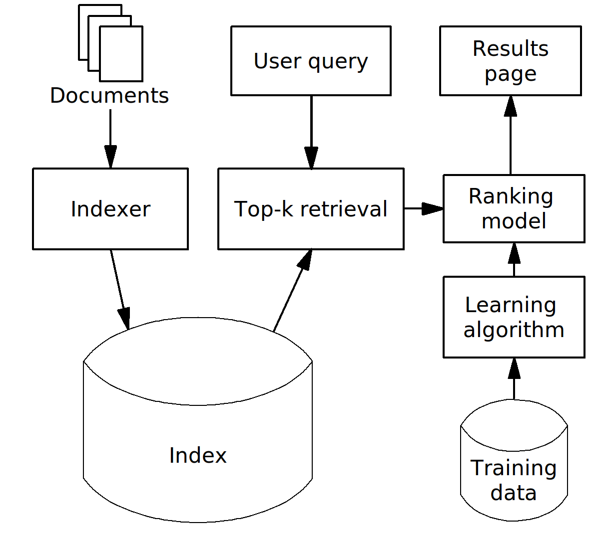
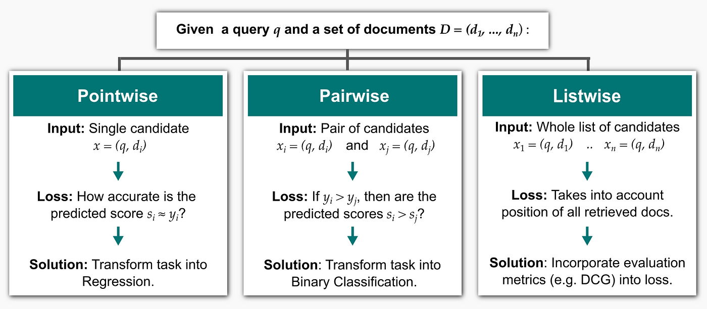
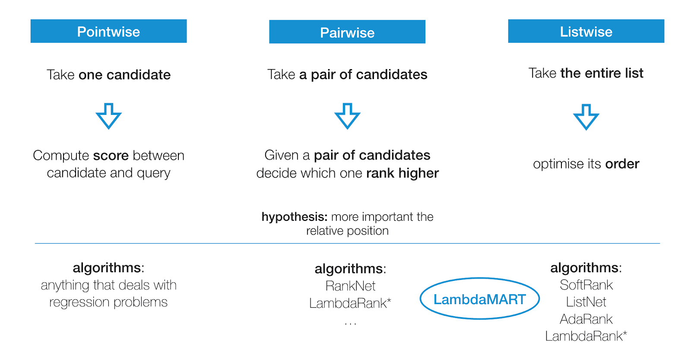
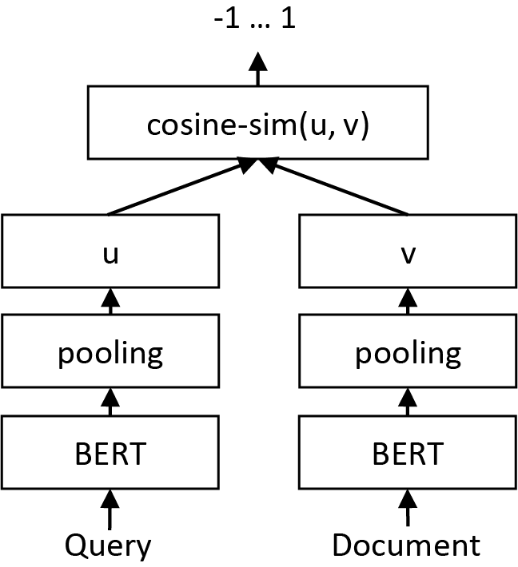
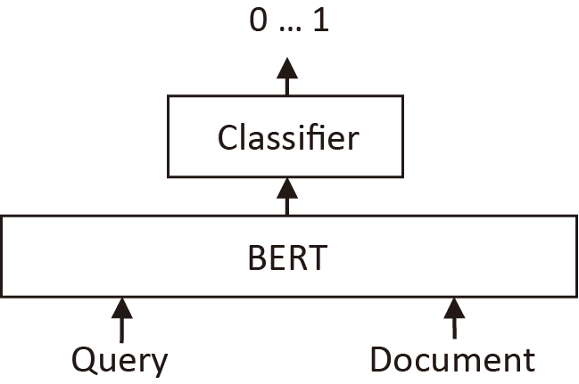
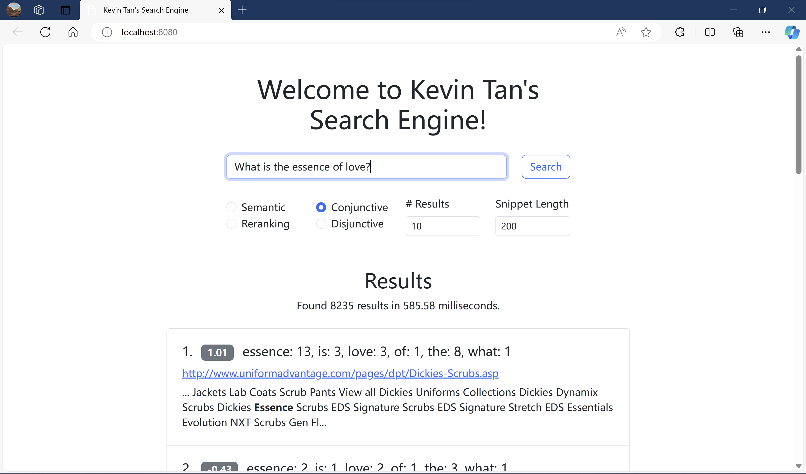

# A Mini Web Search Engine

Kevin Tan

---

**_Abstract—_ Web search engines are irreplaceable in people’s daily lives. However, people tend to take them for granted and ignore their principles. In this paper, a web search engine is built from scratch, supporting indexing a large dataset into a compressed form with limited memory, searching by multilingual conjunctive or disjunctive queries, and interacting from a responsive web page or command lines. By designing and implementing the search engine, the author gains a deeper understanding of web search engines and acquires practical skills for similar tasks.**

Please see [readme_assignment.md](readme_assignment.md) for more details on the implementation of the search engine.


*Figure 1. The Web Search Engine Supporting Semantic Search*

# Enhancing Search Quality Using Transformer-Based Semantic Search on the MS MARCO Dataset

Kevin Tan

---

**_Abstract—_ Search quality is essential for web search engines. Traditional search methods like BM25 have served as baselines for information retrieval, but they often fall short in understanding semantic relationships within queries and documents, resulting in low relevancy. This project leverages Transformer-based semantic search techniques to enhance search quality on the MS MARCO dataset. A sentence Transformer model generates corpus embeddings of queries and documents, and cosine similarity is used to perform the semantic search. Comparative experiments show that the MRR@10 is 0.315, more than twice BM25’s 0.152. In addition, a Transformer-based cross-encoder is used to rerank the semantic search results. Furthermore, this new approach is integrated into the search engine developed in previous assignments to make it more powerful while achieving good real-time search efficiency.**

## I. Introduction

Document ranking is crucial to search quality. Over time, traditional methods such as BM25 have been the go-to for ranking documents based on keyword occurrences. The BM25 formula[^BM25] is shown as follows:
$$
\begin{align}
\operatorname{BM25}(d, q) &= \sum_{t \in q} \operatorname{IDF}(t) \cdot \operatorname{TF}(d, t), \\
\operatorname{IDF}(t) &= \log \left(\frac{N-f_t+0.5}{f_t+0.5}\right), \\
\operatorname{TF}(d, t) &= \frac{f_{d, t} \cdot\left(k_1+1\right)}{f_{d, t}+k_1 \cdot\left(1-b+b \cdot l_d / l_{\mathrm{avg}}\right)},
\end{align}
$$
where $d$ is the document, $q$ is the query, $N$ is the number of documents in the collection, $f_t$ is the document frequency of term $t$, $f_{d,t}$ is the frequency of $t$ in $d$, $l_d$ is the length of document $d$, and $l_\text{avg}$ is the average document length. Parameters can be set to be $k_1 = 0.9$ and $b = 0.4$, as described by Trotman et al.[^BM25Param] BM25 considers the frequency of a term within a document. It assumes that the more frequently a term appears in a document, the more important it might be for that document. It also factors in the rarity of the term in the entire document corpus. Rare terms across the corpus receive higher weights as they are considered more valuable for distinguishing documents. In addition, it adjusts for document length, penalizing longer documents. Longer documents tend to have more occurrences of terms, so BM25 normalizes the TF component to avoid bias toward longer documents. Finally, the formula employs a saturation function, ensuring that excessively high term frequencies within a document do not overly influence the relevance score.

While effective, these approaches often struggle to understand the intricate semantic nuances embedded within queries and documents. For example, BM25 assumes terms are somewhat independent of each other, disregarding word order and context within the query and the document. Consequently, the demand for search engines capable of grasping deeper semantic relationships has led to the emergence of novel methodologies.

One approach, learning-to-rank, employs machine learning models to understand relevance beyond keyword matching. Instead of using only one function, such as BM25, it employs more features extracted from queries and documents to rank documents. A typical system pipeline is shown in Fig. 2. There are three approaches to learning-to-rank, namely pointwise, pairwise, and listwise, which are described in Fig. 3 and Fig. 4. Although it achieves better results than traditional methods due to richer representations of queries and documents, it usually needs manual feature engineering that may need domain knowledge, is time-consuming, and might not capture intricate semantic relationships between words and phrases effectively. Learning from handcrafted features potentially limits the model’s ability to handle complex language nuances.



*Figure 2. The Pipeline of a Typical Learning-to-Rank System*[^LTRPipeline]


*Figure 3. Three Approaches to Learning-to-Rank*[^LTRApproachesFormal]


*Figure 4. Algorithms for Three Approaches to Learning-to-Rank*[^LTRApproachesCasual]

A notable evolution has come through Transformer-based methods. Transformers, due to their attention mechanisms, excel at converting queries and documents into dense semantic embeddings that capture their meaning and context effectively and automatically, alleviating the need for manual feature engineering and potentially capturing more nuanced relationships in the data. In addition, pre-trained models can leverage transfer learning, benefiting from pre-existing knowledge learned from large-scale datasets. This capability reduces the dependency on domain-specific labeled data for achieving good performance. The pipeline is shown in Fig. 5.


*Figure 5. The Pipeline of Transformer-based Semantic Search and Re-ranking*[^TransformerPipeline]

Considering the above, we choose Transformer-based methods. The main achievements of this project are as follows:

- Utilized Transformer-based models to implement semantic search on the MS MARCO dataset.
- Measured and compared the performance of the Transformer-based approach and the traditional BM25 algorithm using search quality metrics, demonstrating the effectiveness of Transformer-based semantic search.
- Seamlessly integrated the Transformer-based semantic search into the search engine developed in previous assignments while achieving good real-time search efficiency.

## II. Method

### 1. Semantic Search

Semantic search seeks to improve search accuracy by understanding the content of the search query. In contrast to traditional methods that only find documents based on lexical matches, semantic search can also find synonyms. The idea is to embed all documents into a corpus vector space. At search time, the query is embedded into the same vector space, and the closest embeddings from the corpus can be found using the cosine similarity since the embeddings are fixed-sized. These entries should have a high semantic overlap with the query. The principle is illustrated in Fig. 6. 



*Figure 6. The Principle of Semantic Search*[^SemanticSearchPrinciple]

Recall that in Fig. 5, there is no index like Fig. 2. This is because we do not match words anymore; instead, all documents in the dataset are transformed into corpus embeddings. The embeddings are just like the indexes of documents. The Transformer is usually called a bi-encoder.

### 2. Reranking

The bi-encoder might return irrelevant candidates. A re-ranker based on a cross-encoder may improve the final results for the user, as it performs attention across the query and the document—the query and a possible document are passed simultaneously to Transformer network, which then outputs a single score between 0 and 1 indicating how relevant the document is for the given query, as shown in Fig. 7. Scoring millions of (query, document)-pairs would be rather slow; it is only suitable for reranking a small set of passages. Hence, we can use the bi-encoder to create a set of (e.g., 32) possible candidates, which are then reranked by the cross-encoder so that the most relevant passages are at the top of the result list.



*Figure 7. The Principle of Reranking*

## III. Implementation and Experiment

### 1. Platform, Dataset, and Metrics

The computational platform is the newest laptop with an Intel i9-13900H CPU (14 cores, 20 threads, up to 5.4 GHz), 48 GB RAM, and an 8 GB NVIDIA 4060 GPU (up to 140 Watt).

The MS MARCO document ranking dataset contains 367013 queries and 384597 ground truths of relevance. There are 12014 empty documents, so the number of valid ones is 3201821.

Since the relevance ground truth only includes true/false values, the Mean Reciprocal Rank (MRR) is used to measure the search quality. Let $r_i$ be the document rank of the $i$th query,
$$
\text{MRR} = \frac{1}{n} \sum_{i = 1}^{n} \frac{1}{r_i}.
$$
Since only 10 documents for each query are returned, if the relevant document is not in the first 10 results, the reciprocal rank of that query is recorded as 0.

### 2. BM25 Baseline

Since there is no thread pool in the standard library of C++, it is implemented from scratch to leverage multiple cores to benchmark the performance of BM25. Mutexes and condition variables are used to distribute tasks to worker threads safely and save results in the daemon thread. A cache is also implemented to boost the evaluation speed, and all classes are designed to be thread-safe to produce reliable results.

The experiment was performed on Linux because of its higher code execution efficiency. It took 7 minutes and 40 seconds to evaluate the performance of the whole dataset, with an MRR@10 of 0.153. It reproduces the official result[^MSMARCO], showing the correctness of the implementation.

### 3. Semantic Search

Due to time and laptop resource constraints, it is infeasible to train Transformers from scratch, so pre-trained models have to be used. The `sentence_transformer` package provides several pre-trained models and utilities suitable for this task. The model is called SBERT[^SBERT], which contains a pooling layer after the output of BERT / RoBERTa, enabling it to derive a fixed-sized sentence embedding. The bi-encoder model `multi-qa-MiniLM-L6-cos-v1` and `msmarco-MiniLM-L6-cos-v5` are tried for semantic search, which both map sentences and paragraphs to a 384-dimensional dense vector space. The former has been trained on 215M question-answer pairs from various sources and domains and performs well across many search tasks and domains. The latter has been trained on 500K (query, answer) pairs from the MS MARCO dataset. They are the fastest models provided by the package. [^PretrainedModels]

To allow memory for subsequent queries, we truncate long articles to 256 tokens. It took 2 hours to generate embeddings of all documents, which is 4.58 GB. Interestingly, the non-compressed binary index created in previous assignments is 4.69 GB, roughly the same size as the embeddings. Generating embeddings for all documents does not require much GPU memory; if the batch size is set to be too large, it may take longer, and the CPU/GPU may not be fully utilized. Evaluating the models’ performance on the entire dataset took less than 9 minutes and consumed 7 GB of GPU memory. The `multi-qa-MiniLM-L6-cos-v1` model achieves an MRR@10 of 0.292, and the `msmarco-MiniLM-L6-cos-v5` model achieves an MRR@10 of 0.315, more than twice that of BM25, showing the effectiveness of the Transformer-based semantic search.

Fig. 1 is the result using the `multi-qa-MiniLM-L6-cos-v1` model. Intuitively, the comparison between Fig. 1 and Fig. 8 shows the semantic search results are indeed more relevant than BM25. Although the semantic results in Fig. 1 do not contain the query word “essence,” the content is very relevant to the query. On the contrary, the BM25 results in Fig. 8 suffer from BM25’s assumption that a scarce word should receive higher weights—although “essence” has the highest frequency in the first passage, it is totally irrelevant to the query, thus highlighting the importance of semantic understanding.


*Figure 8. Irrelevant Results of BM25*

### 4. Reranking

The cross-encoder model `ms-marco-MiniLM-L-6-v2` is used for reranking the results from the semantic search because it has a higher MRR than the `L-4` version and is only 0.0001 lower but much faster than the `L-12` version MRR. It took 15 hours on Linux to evaluate the performance of the whole dataset, consuming 8 GB of GPU memory and 110 W of GPU power with a batch size of 224. The model achieves an MRR@10 of 0.173, which is unexpectedly lower than the semantic search result of the `multi-qa-MiniLM-L6-cos-v1` model and the result claimed for the `dev` dataset of MS MARCO. The likely reason for this is that in the current implementation, excessively long articles are automatically truncated by the model, which produces inaccurate results. One possible improvement is to split long articles with an overlapping window and to take only the maximum value for paragraphs belonging to the same article during retrieval. The first passage in the search results shown in Fig. 9 also seems not so relevant to the query, but it is much better than the purely irrelevant results of BM25.


*Figure 9. Results of Reranking*

### 5. Integration

Since the `sentence_transformer` package is on Python, integration needs to call Python code from C++ using the CPython C API. Memory management requires special attention and effort, and various cases that require `INCREF`, `DECREF`, and those that do not need `INCREF` or `DECREF` due to built-in objects “stealing” references are well considered to prevent memory leaks. Besides, in the web mode, the system has multiple threads, preventing the Python interpreter acquiring the Global Interpreter Lock (GIL). Thus, we use `Py_BEGIN_ALLOW_THREADS auto gstate = PyGILState_Ensure();` and `PyGILState_Release(gstate); Py_END_ALLOW_THREADS` to force the interpreter to execute Python code while there are other non-Python threads running. New queries can be executed typically in hundreds of milliseconds, as shown in Fig. 1 and Fig. 9, demonstrating good efficiency.

## IV. Conclusion

In this project, the Transformer-based semantic search approach is employed to improve the search quality on the MS MARCO dataset. Comparative experiments show that semantic search achieves better relevance than BM25. Semantic search is also integrated into the search engine developed in previous assignments, making it more powerful while remaining efficient. In the future, we can ensemble more state-of-the-art methods or propose new approaches to boost its performance. By researching, designing, and implementing the search engine, the author has gained a deeper understanding and a broader perspective on web search engines and information retrieval, as well as practical skills for similar tasks.

## Appendix

### 1. File Description

#### a. `convert_ids.cpp`

This file converts raw document IDs in the MS MARCO dataset to numerical IDs used in other programs. It calls Win32 API to use memory maps to parse the dataset efficiently.

```shell
Usage: ./convert_ids [-h] [-d dataset_file_path]
Options:
        -d      dataset path, default: fulldocs-new.trec
        -h      help
```

#### b. `evaluation.cpp`

This file evaluates MRR@10 of BM25 on the whole dataset. It uses all logical cores by default.

```shell
Usage: ./evaluation [-h] [-p doc_info_file] [-s storage_info_file]
        [-i index_ids_file] [-f index_freqs_file] [-t index_file_type]
        [-q queries_path] [-r relevance_path] [-n n_results] [-m n_threads]
        [-c cache_size]
Options:
        -p      doc info (page table) file, default: docs.txt
        -s      storage info (lexicon) file, default: storage_vbyte.txt
        -i      index ids file, default: merged_index.vbyte
        -f      index freqs file, default: freqs.vbyte
        -t      index file type (bin|vbyte), default: vbyte
        -q      queries path, default: queries.doctrain.tsv
        -r      relevance path, default: msmarco-doctrain-qrels-idconverted.tsv
        -n      number of results, default: 10
        -m      number of threads, default: number of logical cores
                (20 on this machine)
        -c      cache size, default: 131072
        -h      help
```

#### c. `save_embeddings.ipynb`

This file is a Jupyter Notebook for saving corpus embeddings of all documents. It also generates the `corpus_id_to_doc_id.txt` file because empty documents are removed in the embeddings; thus, new corpus IDs are formed, but they are not removed during indexing, so it will be needed to look up document IDs according to corpus IDs. It loads the whole dataset into the memory, so at least 64 GB of memory is required to avoid memory swapping.

#### d. `eval_semantic_search.ipynb`

This file is a Jupyter Notebook for evaluating the semantic search performance on the whole dataset. 

#### e. `eval_rerank.ipynb`

This file is a Jupyter Notebook for evaluating the performance of reranking on the whole dataset. 

#### c. `learning_to_rank.py` (although it is not the learning-to-rank mentioned above)

This file is a Python script that loads the bi-encoder, cross-encoder, and corpus embeddings, and contains the `semantic_search` and the `rerank_inplace` functions. Default values including `device = 'cuda' if torch.cuda.is_available() else 'cpu'`, `bi_encoder.max_seq_length = 256`, `top_k = 32` and `corpus_embeddings.pt` can be modified directly from this file. It maps `corpus_embeddings.pt` directly to the memory that GPU can access, avoiding the overhead of copying the data from the disk to the main memory at first when using the CUDA backend. However, the file name and function signature cannot be modified without also modifying the `main.cpp` file.

#### d. `main.cpp` and the `index.html` web page

`main.exe` reads the page table and the lexicon into the memory and waits for input from the user. 

***For BM25-Based Retrieval.*** After receiving the user’s query, it cleans it, removing leading and trailing blanks and repeated terms, and converts ascii letters to lowercase letters. Then, it checks if the query result is in the cache. If it is, it returns the cached result. Otherwise, it checks if each term’s index entry is in the cache. If not, it gets the storage information from the lexicon and reads entries of query terms from the index file. After that, it selects documents based on the query type, conjunctive and disjunctive. Since `docID`s are sorted, conjunctive query intersects `docID`s in $O(n)$ time, and disjunctive query unions `docID`s also in $O(n)$ time. Then, it calculates the ranking score of the selected documents using BM25 and sorts them based on the score. The consideration here is the same as `create_index`.

***For Transformer-Based Retrieval.*** After receiving the user’s query, it checks if the query result is in the cache. If it is, it returns the cached result. Otherwise, it calls the Python function to perform semantic search. If the query type is `RERANKING`, it then calls the Python function to perform reranking.

After that, it caches the result and generates snippets of the result. It seeks the dataset according to the information in the page table, tokenizes the document, finds the first occurrence of one of the query terms, and expands the start and end positions of the snippet according to this position. Since the snippet length can be changed via the web API, there is no point in caching snippets. Finally, it returns the results to the web or the terminal. During the entire process, pointers are used to avoid copying arrays for efficiency.

The single-header library `httplib.h` is used for the program to become a web server. The server responds with `index.html` for HTTP GET requests and JSON for HTTP POST requests to the root. The server is robust to bad requests, including malformed JSON, missing properties, type-mismatch, invalid values, etc. In `index.html`, Bootstrap is used to build the responsive UI, and `axios` is used to send asynchronized HTTP POST requests to the server. Results are dynamically added to the page using JavaScript.

An example of the JSON sent from the web is shown as follows:

```json
{
    "query": "<query words>",
    "query_type": 1,
    // 1: conjunctive, 2: disjunctive, 3: semantic, 4: reranking
    "n_results": 10,
    "snippet_len": 200
}
```

An example of a successful query of the JSON returned from the server is shown as follows:

```json
{
    "cached": true,
    "time": 1, // in microseconds
    "count": 10000,
    "data": [
        {
            "rank": 1,
            "score": 7.6,
            "freqs": [["<a query word>", 1000], /*...*/],
            // only BM25-based retrieval has this field
            "url": "<url>"
            "snippet": "<snippet>"
        }, // ...
    ]
}
```

`learning_to_rank.py` must be located in the current working directory of `main.exe`. On Windows, `python3xx.dll` must be in the `PATH` environment variable. On Linux, `libpython3xx.so` must be in the `LD_LIBRARY_PATH`. The linked Python environment must have `sentence_transformer` installed, which can be installed using `pip install sentence_transformer`.

```shell
Usage: ./main [-h] [-d dataset_file] [-p doc_info_file] [-s storage_info_file]
        [-i index_ids_file] [-f index_freqs_file] [-t index_file_type]
        [-c corpus_id_to_doc_id_file] [-w server_port] [-q query_type]
        [-n n_results] [-l snippet_len] [-m cache_size]
Options:
        -d      dataset file, default: fulldocs-new.trec
        -p      doc info (page table) file, default: docs.txt
        -s      storage info (lexicon) file, default: storage_vbyte.txt
        -i      index ids file, default: merged_index.vbyte
        -f      index freqs file, default: freqs.vbyte
        -t      index file type (bin|vbyte), default: vbyte
        -c      corpus id to doc id file, default: corpus_id_to_doc_id.txt
        -w      server port ([0, 65535] for web, others for cli), default: 8080
        -q      query type for cli (conjunctive|disjunctive|semantic|reranking),
                default: semantic
        -n      number of results, default: 10
        -l      snippet length, default: 200
        -m      cache size, default: 1000
        -h      help
```

### 2. Limitations

- Other models trained using multi-language sources are needed to support multi-language.
- The web server is not designed to receive concurrent queries. This decision keeps the program lightweight.

## References

[^BM25]: S. E. Robertson, S. Walker, S. Jones, M. Hancock-Beaulieu, and M. Gatford. Okapi at TREC-3.
[^BM25Param]: A. Trotman, X-F. Jia, and M. Crane. Towards an efficient and effective search engine.
[^LTRPipeline]: [R. Cummins and T. Briscoe. Learning to Rank.](https://www.cl.cam.ac.uk/teaching/1516/R222/l2r-overview.pdf)
[^LTRApproachesFormal]: [F. Casalegno. Learning to Rank: A Complete Guide to Ranking using Machine Learning.](https://miro.medium.com/v2/resize:fit:1400/format:webp/1*s3CQuNRWcQNkQKd8Met-MA.png)
[^LTRApproachesCasual]: [J. Le. The ABCs of Learning to Rank.](https://lucidworks.com/wp-content/uploads/2019/11/list_wise_lucidworks.png)
[^TransformerPipeline]: [sbert.net](https://raw.githubusercontent.com/UKPLab/sentence-transformers/master/docs/img/InformationRetrieval.png)
[^SemanticSearchPrinciple]: [sbert.net](https://raw.githubusercontent.com/UKPLab/sentence-transformers/master/docs/img/SemanticSearch.png)
[^SBERT]: N. Reimers and I. Gurevych. Sentence-BERT: Sentence Embeddings using Siamese BERT-Networks.
[^PretrainedModels]: [Pretrained Models — Sentence-Transformers documentation (sbert.net)](https://www.sbert.net/docs/pretrained_models.html)
[^MSMARCO]: N. Craswell, B. Mitra, E. Yilmaz, D. Campos, and J. Lin. MS MARCO: Benchmarking Ranking Models in the Large-Data Regime.
