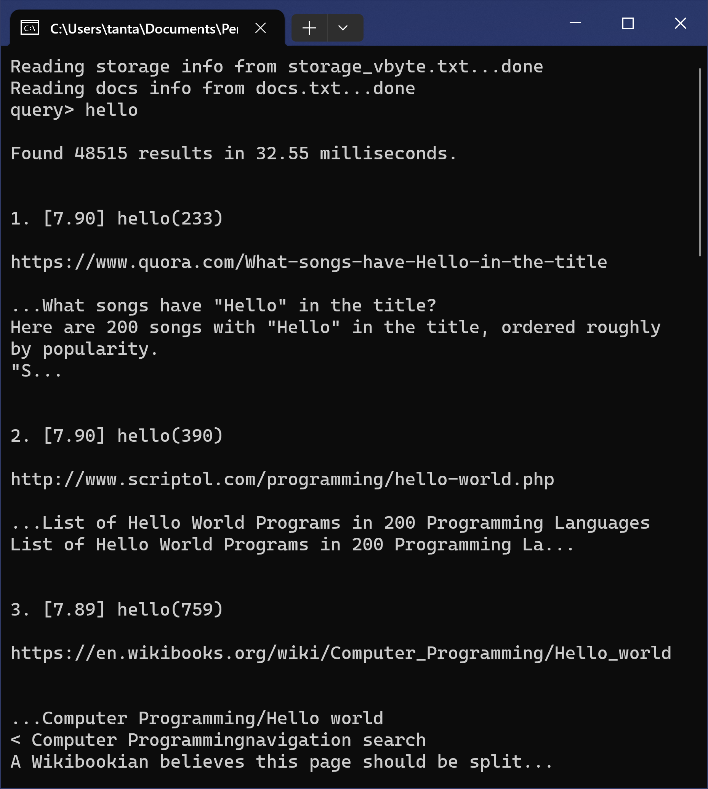

# A Mini Web Search Engine

Kevin Tan

---

**_Abstract—_ Web search engines are irreplaceable in people’s daily lives. However, people tend to take them for granted and ignore their principles. In this paper, a web search engine is built from scratch, supporting indexing a large dataset into a compressed form with limited memory, searching by multilingual conjunctive or disjunctive queries, and interacting from a responsive web page or command lines. By designing and implementing the search engine, the author gains a deeper understanding of web search engines and acquires practical skills for similar tasks.**


*Figure 1. A Mini Web Search Engine*

## I. Overview

Ostensibly, a search engine receives a user’s input and then finds relevant results to return to the user. However, it must achieve high efficiency with limited resources, especially memory and disk space. Unlike the usual space-for-time algorithms, the trade-off between time and space must be considered everywhere when implementing a search engine, as the data sets are large, and even trading time for space is required.

The search engine needs to accomplish the following tasks to achieve the desired functionality:

1. Indexing a large dataset into an inverted index, which is basically a table with terms being the key and information related to the term being its value. Such information includes IDs of documents that contain the term and frequencies of the term in each document. Note that the index may be very large, so it is first generated in sorted chunks and then merged. During indexing, the dataset is tokenized to determine the boundaries of each term.
2. Preparing auxiliary data structures to speed up the query, including a table of document information, such as URL, number of terms, begin and end positions in the dataset, and a table of storage information (lexicon), which contains each term’s start position in the index and number of documents containing the word.
3. Receiving and cleaning the query. The query may have leading and trailing blanks, repeated terms, consecutive blanks, and a mix of upper and lower case letters.
4. Checking if the query result is in the cache. If it is, return the cached result.
5. Getting the storage information from the lexicon and reading entries of query terms from the index file.
6. Selecting documents based on the query type, conjunctive or disjunctive.
7. Calculating the ranking score of the selected documents and sorting the results based on the score.
8. Caching the result.
9. Generating snippets of the result.
10. Returning the result.

## II. Details

The search engine contains three programs that create an inverted index from the `msmarco-docs.trec.gz` dataset and process user’s query from the web or the command line.

### 1. Language

All the programs are written in the new standard of C++. A modern C++ compiler that supports the C++17 (maybe) standard is needed to compile the programs. The programs are tested on Windows and may work on Unix-based systems without modifying any code.

### 2. Disk-based Index Structures

The programs create the following four files at the end, where `<type>` is among `txt`, `bin`, and `vbyte`, corresponding to different supported formats.

- `merged_index.<type>`: The inverted index.
- `freqs.<type>`: The frequencies of each term in each document.
- `docs.txt`: The page table for looking up the URL, the number of terms, and the start and end position in the dataset of a document given its `docID`.
- `storage_<type>.txt`: The lexicon, a table for positioning a term’s start position in the inverted index and the frequency file and looking up the number of docs containing the word.

### 3. Problem Decomposition

The first program, `create_index`, reads the dataset into memory by chunks, parses the dataset, creates the sorted inverted index and frequency file for each chunk, and prepares the page table.

The second program, `merge_index`, reads the inverted index and frequency file created by the first program by chunks, merges them by a $k$-way merge sort, and prepares the lexicon.

The third program, `main`,  performs the query task. It is also a web server in the web mode.

All programs are designed to be I/O-efficient, i.e., they can run fast when memory is limited.

### 4. Parsing

Since HTML has already been removed, the dataset is parsed from scratch. No parsing library is needed.

### 5. Data Format

The first program supports both the `gzip`-compressed format and the uncompressed format. `zlib` library is built from source and dynamically linked to the first program when it starts on Windows. On Unix-based systems, you may install `zlib` using a package manager and tell `cmake` to automatically find and link the library in the `CMakeLists.txt` more elegantly. The program automatically detects whether the dataset is compressed or not.

The third program could trivially support the `gzip`-compressed format, but considering efficiency, it is currently not supported.

### 6. Index File Format

The supported formats of **temporary small chunks of index** files created by the first program are as follows:

- `.txt` file: The human-readable text format for debugging. Each entry takes up one line containing the term and its `docID`s or frequencies, separated by a space.
- `.bin` file: The uncompressed binary format. Each entry starts with the term, followed by a space, then by `docID`s, then by an `unsigned int` indicating the number of `docID`s. The rest of the entry is compressed `docID`s. Each `docID` takes up `sizeof(unsigned)` bytes, which is typically 4 bytes. For frequency files, they are the same as above, except that there is no need to store term strings.
- **`.vbyte` file: The same as above, except that all `docID`s and frequencies are stored in a compressed format using the `vbyte` algorithm.**

The supported formats of the **final merged index** created by the second program are as follows:

- `.txt` file: The same as above. `docID`s in each term can be stored in difference to save storage.
- `.bin` file: The uncompressed binary format. All `docID`s are stored consecutively. `docID`s in each term can be stored in difference. The start position and number of documents of each entry are indicated by the lexicon. Each `docID` takes up `sizeof(unsigned)` bytes, which is typically 4 bytes. For frequency files, they are the same as above, except that there is no need to store differences.
- **`.vbyte` file: The same as above, except that all `docID`s and frequencies are stored in a compressed format using the `vbyte` algorithm.** For frequency files, there is no need to store differences to achieve a high compression rate because frequencies are relatively small.

### 7. `DocID`s and Terms

`DocID`s are assigned in the order in which the pages are parsed, so the page table does not need to store the `docID`s. Terms are kept in textual format, and the final inverted lists do not have terms inside each posting.

### 8. Unicode

Everything is kept using the UTF-8 encoding to save memory. When parsing, if a character is within the ASCII range, `isalnum` is used to determine word boundaries. Otherwise, only “General Punctuation” (UTF-8 `0xE28080`-`0xE280AF`) and “CJK Symbols and Punctuation” (UTF-8 `0xE38080`-`0xE381BF`) of the Unicode blocks are regarded as word boundaries because Unicode has so many symbols and invisible characters that should probably be part of the word. Characters not in the ASCII range are not converted to “lower” cases because it may have drawbacks for many languages.

### 9. Query Execution

For extendibility and maintainability, the code uses STL and the new standard of C++. Thus, the interface for accessing inverted lists at an intermediate level in the architecture has different function names and signatures from those introduced in the slides while hiding details such as file input and inverted list compression techniques from the higher-level query processor.

### 10. Ranked Queries

The program computes ranked queries according to the BM25 formula [1]
$$
\begin{align}
\operatorname{BM25}(d, q) &= \sum_{t \in q} \operatorname{IDF}(t) \cdot \operatorname{TF}(d, t), \\
\operatorname{IDF}(t) &= \log \left(\frac{N-f_t+0.5}{f_t+0.5}\right), \\
\operatorname{TF}(d, t) &= \frac{f_{d, t} \cdot\left(k_1+1\right)}{f_{d, t}+k_1 \cdot\left(1-b+b \cdot l_d / l_{\mathrm{avg}}\right)},
\end{align}
$$
where $d$ is the document, $q$ is the query, $N$ is the number of documents in the collection, $f_t$ is the document frequency of term $t$, $f_{d,t}$ is the frequency of $t$ in $d$, $l_d$ is the length of document $d$, and $l_\text{avg}$ is the average document length. Parameters are set to be $k_1 = 0.9$ and $b = 0.4$, as described by Trotman et al. [2]

The top $n$ results are returned according to the scoring function, where $n$ is defaulted to be 10 and can be set via command line arguments or the web page. For each top result, its score according to the ranking function and the frequency of each search term in the document are returned. Conjunctive and disjunctive queries are implemented, which can also be chosen via command line arguments or the web page.

### 11. Interface

A responsive web page is built, which is shown in Fig.1 and Fig. 2(a). Users can choose query type (conjunctive or disjunctive), number of results, and snippet length. The query words are bolded in the snippet. Ranking scores and query word frequencies are displayed. The web page is responsive in extreme cases and renders according to the browser’s color theme. Querying multilingual words is supported.

Users can also access via the command line, which is shown in Fig. 2(b). Users can choose query type (conjunctive or disjunctive), number of results, and snippet length via command line arguments. Ranking scores and query word frequencies are displayed. Querying multilingual words is only supported if the terminal is UTF-8 encoded.



*(a)               (b)*
*Figure 2. The responsive web page supporting multilingual queries and the command line interface*

Users can press `Ctrl-C` to exit the program. Resources are released during exit.

### 12. Startup

Upon startup, the query processor reads the complete lexicon and page table from disk into main memory. After the user inputs a query, the program then seeks the file to read only those inverted lists that correspond to query words and then computes the result. After returning the result, the program waits for the next query to be input. **Caching is implemented** using LRU caches. The amount of memory that is used for index caching can be set via a command line argument.

### 13. Index Compression

The program supports inverted index in binary format and `vbyte`-compressed format. For the latter, it is only uncompressed on demand.

## III. How to Run the Programs

### 1. `create_index`

On Windows, please make sure `zlibwapi.dll` and `create_index.exe` are in the same directory.

```shell
Usage: ./create_index [-h] [-d dataset_file_path] [-i index_path] [-p doc_info_path]
        [-t index_type] [-b input_buffer_size] [-e output_entry_size]
Options:
        -d      dataset path, default: msmarco-docs.trec.gz
        -i      index path, default: index
        -p      doc info (page table) path, default: .
        -t      index type (txt|bin|vbyte), default: vbyte
        -b      input buffer size (unsigned int but must < 2GB, unit: bytes),
                default: 256MB
        -e      output entry size, default: 1000000
        -h      help
```

### 2. `merge_index`

```shell
Usage: ./merge_index [-h] [-i index_path] [-s storage_path] [-o merged_index_path]
        [-t input_index_type] [-m merged_index_type] [-d store_diff]
        [-c input_index_chunk_size] [-e output_entry_size]
Options:
        -i      index path, default: index
        -s      storage info (lexicon) path, default: .
        -o      merged index path, default: .
        -t      input index type (txt|bin|vbyte), default: vbyte
        -m      merged index type (txt|bin|vbyte), default: vbyte
        -d      store diff docIDs in the merged index (true|false), default: true
        -c      input index chunk size, default: 5000
        -e      output entry size, default: 100000
        -h      help
```

### 3. `main`

```bash
Usage: ./main [-h] [-d dataset_file] [-p doc_info_file] [-s storage_info_file]
        [-i index_ids_file] [-f index_freqs_file] [-t index_file_type]
        [-w server_port] [-c conjunctive_query] [-n n_results] [-l snippet_len]
        [-m cache_size]
Options:
        -d      dataset file, default: fulldocs-new.trec
        -p      doc info (page table) file, default: docs.txt
        -s      storage info (lexicon) file, default: storage_vbyte.txt
        -i      index ids file, default: merged_index.vbyte
        -f      index freqs file, default: freqs.vbyte
        -t      index file type (bin|vbyte), default: vbyte
        -w      server port ([0, 65535] for web, others for cli), default: 8080
        -c      conjunctive query for cli (true|false), default: true
        -n      number of results, default: 10
        -l      snippet length, default: 200
        -m      cache size, default: 1000
        -h      help
```

## III. How It Works Internally, Design Decisions, Limitations, and Major Parts

The programs first set up default options and update them according to the parsed command line input. 

### 1. `create_index`

Then, it starts to read and parse the dataset.

When it comes to efficient I/O, the most efficient one should be memory mapping, which avoids copying data between the kernel space and the user space. The OS controls whether the data have been actually loaded into the memory or written to the disk; no byte array is needed. In addition, user-level data structures can only store pointers to the mapped memory to represent corresponding strings rather than copy them. However, I was asked not to use memory mapping for indexing. Then, the most efficient I/O should be to read a chunk into a buffer, parse it until it reaches the end, read another chunk, and so forth. Strings also have to be copied because the buffer may be updated before the strings are used.

When indexing, `unordered_map` is used, which is a Hash table storing each term, its `docID`s, and the term’s frequency in each document. When its size reaches the `output_entry_size`, this chunk of the index is sorted according to the terms and then written to the disk. `DocID`s and frequencies are stored in separate files for better maintainability and efficiency. This part of the page table is also written to the disk. Although sorting an `unordered_map` requires $O(n \log n)$ time, it is only needed before it is written to disk and does not copy data since pointers are used. More operations are `find` and `insert`, which take $O(1)$ in `unordered_map` and $O(\log n)$ in `map`. Thus, `unordered_map` should be more efficient. `vector`, a dynamic array, is used to store the page table. Finally, all indexes and the page table are written to the disk.

### 2. `merge_index`

Then, it reads `input_index_chunk_size` of each temporary index file produced by `create_index` and then pushes all the first entries of these chunks and their sources into a `priority_queue`. The smallest entry gets out of the queue and is appended to or merged into the last entry of the final index, which is a `vector`, and the head entry of its source gets into the queue. When a chunk is empty, new entries from the same source are loaded. This is a $k$-way merge sort. When the final index reaches `output_entry_size`, it is written to the disk and cleared to save memory. Lexicon is recorded simultaneously and is written to the disk and cleared to save memory after this chunk of the final index is written to the disk and cleared. Ultimately, all indexes and the lexicon are written to the disk.

Frequencies, not BM25 scores, are stored based on the following considerations. First, BM25 scores are floats, so they must be quantized for better compression. However, some scores are too close and may lose accuracy if quantized. Second, calculating BM25 at indexing significantly increases time usage, and since there are so many words and articles, most of the calculation results will never be used.

### 3. The `main` program and the `index.html` web page

Then, it reads the page table and the lexicon into the memory and waits for input from the user. After receiving the user’s query, it cleans it, removing leading and trailing blanks and repeated terms, and converts ascii letters to lowercase letters. Then, it checks if the query result is in the cache. If it is, it returns the cached result. Otherwise, it checks if each term’s index entry is in the cache. If not, it gets the storage information from the lexicon and reads entries of query terms from the index file. After that, it selects documents based on the query type, conjunctive and disjunctive. Since `docID`s are sorted, conjunctive query intersects `docID`s in $O(n)$ time, and disjunctive query unions `docID`s also in $O(n)$ time. Then, it calculates the ranking score of the selected documents using BM25 and sorts them based on the score. The consideration here is the same as `create_index`. After that, it caches the result and generates snippets of the result. It seeks the dataset according to the information in the page table, tokenizes the document, finds the first occurrence of one of the query terms, and expands the start and end positions of the snippet according to this position. Since the snippet length can be changed via the web API, there is no point in caching snippets. Finally, it returns the results to the web or the terminal. During the entire process, pointers are used to avoid copying arrays for efficiency.

The single-header library `httplib.h` is used for the program to become a web server. The server responds with `index.html` for HTTP GET requests and JSON for HTTP POST requests to the root. The server is robust to bad requests, including malformed JSON, missing properties, type-mismatch, invalid values, etc. In `index.html`, Bootstrap is used to build the responsive UI, and `axios` is used to send asynchronized HTTP POST requests to the server. Results are dynamically added to the page using JavaScript.

An example of the JSON sent from the web is shown as follows:

```json
{
    "query": "<query words>",
    "conjunctive": true,
    "n_results": 10,
    "snippet_len": 200
}
```

An example of a successful query of the JSON returned from the server is shown as follows:

```json
{
    "cached": true,
    "time": 1, // in microseconds
    "count": 10000,
    "data": [
        {
            "rank": 1,
            "score": 7.6,
            "freqs": [["<a query word>", 1000], /*...*/],
            "url": "<url>"
            "snippet": "<snippet>"
        }, // ...
    ]
}
```

### 4. Common

There are no major limitations of the programs; however, there are requirements for the input and the environment:

- The `output_entry_size` of `create_index` cannot be too small. Otherwise, there will be too many index files to be merged, and thus, the maximum limit of simultaneous open files may be reached in `merge_index`. No more than 253 files (actually 256 files, including `stdin`, `stdout`, and `stderr`) can be opened at the same time.
- The `input_buffer_size` must be less than 2 GB because `gzread` returns `int`. If a buffer larger than 2 GB is needed without memory mapping, more code will be involved, but the program does not require so much memory.
- The dataset should not have more than $2^{32}$ documents because `doc_cnt` is an `unsigned int`. Each document cannot have more than $2^{32}$ terms because `term_cnt` is an `unsigned int`. They could be `size_t`, but then it would take up more memory.
- The dataset should not contain UTF-8 characters with more than 4 bytes because they are rare, and `msmarco-docs.trec.gz` does not have them.
- The line break of text files should not be `\r\n` because `msmarco-docs.trec.gz` uses `\n`, and it would be more inefficient to detect `\r` when parsing such large files.
- Binary files produced by the programs cannot be shared across processors with different endian. Most processors have the same endian, and it would be more inefficient to detect endianness in the program that processes such large files.
- The web server is not designed to receive concurrent queries. This decision keeps the program lightweight.

## IV. Results

The programs run on a laptop with an i7-9750H CPU clocked at 2.9 GHz and 64 GB RAM. The programs are compiled using the MSVC compiler. The performance is subject to the status of the computer at that time. They will run much faster on newer platforms and Unix-based systems.

### 1. `create_index`

With default options, the program takes almost 19 minutes to produce 75 chunks of temporary index files with less than 90 MB each. The page table is 217 MB with 3213835 documents. The peak of the memory use is 686 MB, as shown in Fig. 3.


*Figure 3. Time and memory usage of `create_index` with default options*

With default options, except that we directly read the uncompressed dataset, the program takes almost 17 minutes to produce the files. The peak of the memory use is 686 MB, as shown in Fig. 4. Uncompressing in advance saves about one minute.


*Figure 3. Time and memory usage of `create_index` with default options but uncompressed dataset*

If `bin` is used instead of `vbyte` in default options and we directly read the uncompressed dataset, the program also takes almost 17 minutes to produce the files. The peak of the memory use is also 686 MB, as shown in Fig. 4. `vbyte` compression consumes about one more minute.


*Figure 4. Time and memory usage of `create_index` with default options but uncompressed dataset and `bin` files*

### 2. `merge_index`

With default options, the program takes 9 minutes and 27 seconds to produce the final index file of 1.52 GB and the frequency file of 1.17 GB, with 25236693 entries and a lexicon of 840 MB. The peak of the memory use is 417 MB, with an average of around 200 MB, as shown in Fig. 5.


*Figure 5. Time and memory usage of `merge_index` with default options*

If `bin` is used instead of `vbyte`, the program takes 6 minutes and 15 seconds to produce the final index file and the frequency file of 4.69 GB for each, with a lexicon of 865 MB. The peak of the memory use is 416 MB, with an average of around 200 MB, as shown in Fig. 6.


*Figure 6. Time and memory usage of `merge_index` with default options but `bin` files*

The compression rate for the index file is
$$
\frac{1.52}{4.69} \times 100\% \approx 32.4\%.
$$
The compression rate for the frequency file is
$$
\frac{1.17}{4.69} \times 100\% \approx 24.9\%.
$$
If raw `docID`s are stored instead of the differences, the final index file will be 3.92 GB, which does not have a good compression rate. However, since word frequencies are relatively small, storing raw frequencies already has a good compression rate. 

### 3. `main`

New queries can be executed typically in tens to hundreds of milliseconds, as shown in Fig. 1 and Fig. 2. Cached query results can be fetched in several microseconds, as shown in Fig. 7.


*Figure 7. Cached query results can be fetched in several microseconds*

Conjunctive queries typically cost less time than disjunctive queries, as shown in Fig.1 and Fig. 8.


*Figure 8. Conjunctive queries typically cost less time than disjunctive queries*

## V. Conclusion and Future Work

In this paper, a web search engine is built from scratch, supporting indexing a large dataset into a compressed form with limited memory, searching by multilingual conjunctive or disjunctive queries, and interacting from a responsive web page or command lines. The program achieves good efficiency and maintainability. In the future, more work can be achieved, such as improving the ranking by PageRank or using Large Language Models (LLMs) to generate better snippets. By designing and implementing the search engine, the author gains a deeper understanding of web search engines and acquires practical skills for similar tasks.

## References

[1] S. E. Robertson, S. Walker, S. Jones, M. Hancock-Beaulieu, and M. Gatford. 1994. Okapi at TREC-3. In *Proc. TREC*.

[2] A. Trotman, X-F. Jia, and M. Crane. 2012. Towards an efficient and effective search engine. In *Wkshp. Open Source IR*. 40–47.
